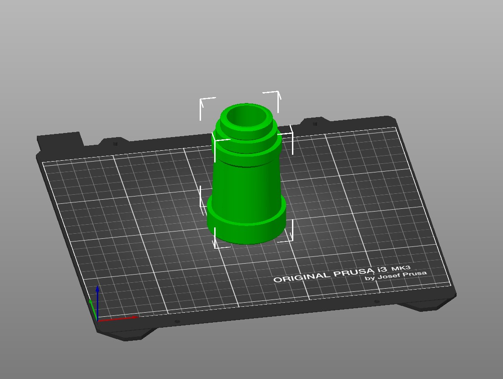

# 3dprint-toy-spyglass

## Kid toy spyglass

Print in place. Printed in PLA on a Prusa MK3s 0.3mm, no brim. Made with OpenSCAD.

## Jouet longue-vue pour enfants

Sans assemblage. Imprimé en PLA sur une Prusa MK3s en 0.3mm, sans support. Réalisé avec OpenSCAD.

